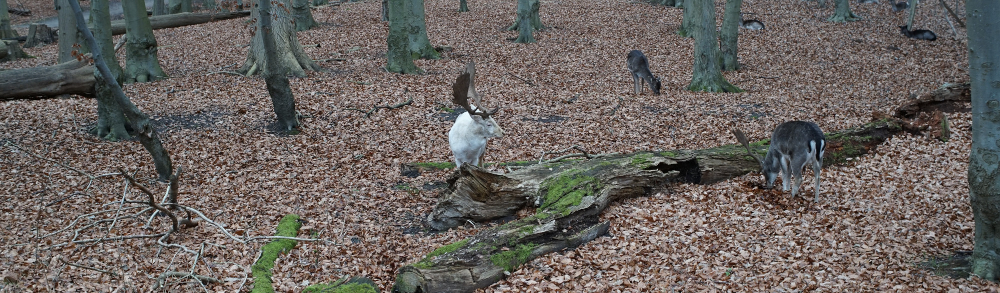

# Introduzione

Un vento tiepido muove le foglie morte mentre il sentiero si perde nel bosco.

::: {.squarebox}
Questa avventura e progettata per un gruppo al Tier 1.  
Usa un tono misterioso, con segnali sottili prima di ogni minaccia.
:::

::: {.roundedbox}
Obiettivo narrativo: trovare il santuario perduto prima che la nebbia ricopra tutto il vallone.
:::

## Primo incontro

::: {.adversary title="Custode del Tronco" tier="Tier 1 Standard" summary="Uno spirito ligneo che custodisce il passaggio." motives="Difendere il bosco, respingere intrusi"}
::: {.stats}
\adversarystats{13}{7/14}{4}{2}{+2}{Ramo Frustante}{Close}{1d8+1 phy}
\myseparator
\textbf{Experiences:} Guardiano del Boschetto +3
:::

::: {.features}
\textbf{Radici Vigili - Passive:} quando viene attaccato in mischia, guadagna +1 Difficulty fino al suo prossimo turno.
:::
:::

## Traversata

::: {.environment title="Ponte di Radici" tier="Tier 1 Traversal" summary="Un intreccio instabile sopra una gola." impulses="Far perdere l'equilibrio, separare il gruppo"}
::: {.stats}
\environmentstats{12}{Custode del Tronco, Sciame di Corvi}
:::

::: {.features}
\textbf{Fenditura Nascosta - Passive:} al primo fallimento con Fear, un personaggio resta isolato dall'altra parte.
:::
:::

::: {.columnbreak}
:::

## Visione del luogo

{ width=100% }

::: {.fullpage}
\setsectioncolor{dg-darkgreen}{dg-darkgreen}

# Capitolo Uno

## Oltre il sentiero

Le tracce conducono verso un cerchio di pietre antiche, dove la nebbia sembra respirare.
:::
